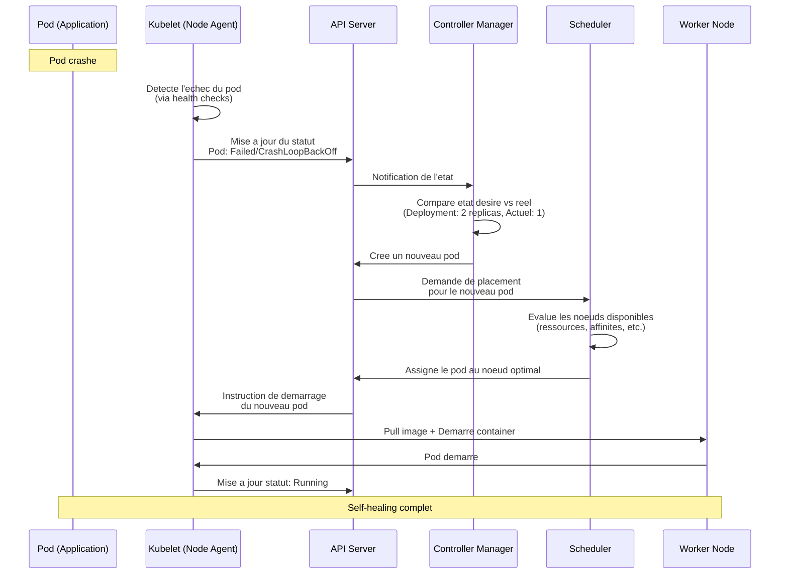
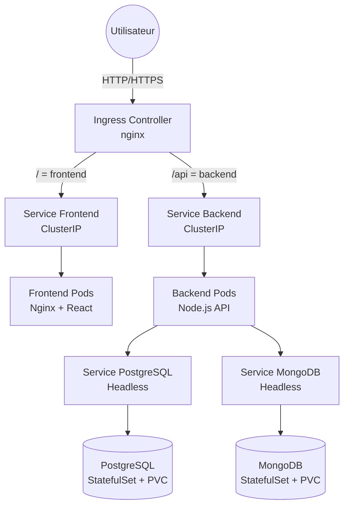

# Deploiement Kubernetes - Restaurant API

Ce guide documente le deploiement de l'application Restaurant API sur Kubernetes et repond aux questions du projet.

## Table des matieres

1. [Diagramme - Fonctionnement Kubernetes lors d'un crash de pod](#1-diagramme---fonctionnement-kubernetes-lors-dun-crash-de-pod)
2. [Deploiement avec Ingress](#2-deploiement-avec-ingress)
3. [Rolling Update et Auto-Scaling](#3-rolling-update-et-auto-scaling)
4. [ConfigMaps, Secrets et PVC](#4-configmaps-secrets-et-pvc)
5. [Liveness et Readiness Probes](#5-liveness-et-readiness-probes)

---

## 1. Diagramme - Fonctionnement Kubernetes lors d'un crash de pod

### Schema explicatif



### Explication des composants

**Kubelet** (Agent sur chaque noeud)
- Surveille en continu l'etat des pods sur son noeud
- Execute les health checks (liveness/readiness probes)
- Reporte l'etat des pods a l'API Server
- Demarre/arrete les containers selon les instructions

**API Server** (Point central de communication)
- Stocke l'etat de tous les objets Kubernetes (etcd)
- Recoit les notifications de tous les composants
- Distribue les informations aux autres composants

**Controller Manager** (Boucle de reconciliation)
- Surveille l'etat desire vs l'etat actuel
- Pour un Deployment avec 2 replicas, si seulement 1 pod est actif, il en cree un nouveau
- Gere le cycle de vie des ReplicaSets, Deployments, etc.

**Scheduler** (Placement intelligent)
- Decide sur quel noeud placer les nouveaux pods
- Considere : ressources disponibles, affinites, taints/tolerations, etc.

---

## 2. Deploiement avec Ingress

### Architecture de deploiement



### Justification de l'architecture des bases de donnees

**Choix : Bases de donnees dans Kubernetes (StatefulSets)**

**Avantages pour ce projet educatif :**
- Deploiement tout-en-un, auto-suffisant (pas besoin de services cloud)
- Permet de demontrer l'utilisation des StatefulSets
- Permet de tester la persistance avec PVCs
- Ideal pour l'environnement de developpement local (minikube/kind)
- Gratuit et reproductible

**Inconvenients en production :**
- Gestion de la haute disponibilite plus complexe
- Backups a gerer manuellement
- Pas de scaling automatique de la base

**Alternative Production :** Utiliser des services manages (Cloud SQL, MongoDB Atlas) pour la production, Kubernetes pour dev/staging.

### Prerequis

```bash
# Verifier que vous avez un cluster Kubernetes
kubectl cluster-info

# Installer Ingress Controller (nginx)
kubectl apply -f https://raw.githubusercontent.com/kubernetes/ingress-nginx/controller-v1.8.2/deploy/static/provider/cloud/deploy.yaml

# Installer Metrics Server (pour HPA)
kubectl apply -f https://github.com/kubernetes-sigs/metrics-server/releases/latest/download/components.yaml

# Pour minikube, activer ingress
minikube addons enable ingress
minikube addons enable metrics-server
```

### Deploiement

```bash
# Creer le namespace
kubectl apply -f namespace.yaml

# Deployer les secrets et configmaps
kubectl apply -f secrets.yaml
kubectl apply -f configmap.yaml

# Deployer PostgreSQL
kubectl apply -f postgres-pvc.yaml
kubectl apply -f postgres-statefulset.yaml
kubectl apply -f postgres-service.yaml

# Deployer MongoDB
kubectl apply -f mongo-pvc.yaml
kubectl apply -f mongo-statefulset.yaml
kubectl apply -f mongo-service.yaml

# Attendre que les bases de donnees soient pretes
kubectl wait --for=condition=ready pod -l app=postgres -n restaurant-api --timeout=300s
kubectl wait --for=condition=ready pod -l app=mongo -n restaurant-api --timeout=300s

# Deployer Backend
kubectl apply -f backend-deployment.yaml
kubectl apply -f backend-service.yaml
kubectl apply -f backend-hpa.yaml

# Deployer Frontend
kubectl apply -f frontend-deployment.yaml
kubectl apply -f frontend-service.yaml

# Configurer Ingress
kubectl apply -f ingress.yaml

# Verifier le deploiement
kubectl get all -n restaurant-api
```

### Acces a l'application

```bash
# Obtenir l'IP de l'Ingress
kubectl get ingress -n restaurant-api

# Pour minikube
minikube ip

# Ajouter dans /etc/hosts (Linux/Mac) ou C:\Windows\System32\drivers\etc\hosts (Windows)
# <INGRESS-IP> restaurant-api.local

# Acceder a l'application
# Frontend: http://restaurant-api.local
# Backend: http://restaurant-api.local/api
# Swagger: http://restaurant-api.local/api-docs
```

---

## 3. Rolling Update et Auto-Scaling

### Rolling Update

#### Configuration de la strategie

Dans `backend-deployment.yaml`, nous utilisons la strategie **RollingUpdate** :

```yaml
strategy:
  type: RollingUpdate
  rollingUpdate:
    maxSurge: 1        # Max 1 pod supplementaire pendant l'update
    maxUnavailable: 0  # Aucun pod ne peut etre indisponible
```

**Strategie alternative : Recreate**

Pour tester la difference, modifiez le deployment :

```yaml
strategy:
  type: Recreate  # Supprime tous les pods avant d'en creer de nouveaux
```

#### Q1. Test et observation du Rolling Update

**Commandes pour tester :**

```bash
# Terminal 1 : Observer les pods en temps reel
kubectl get pods -n restaurant-api -w

# Terminal 2 : Declencher un rolling update (changer l'image)
kubectl set image deployment/backend-deployment backend=orium_backend:v2 -n restaurant-api

# Alternative : modifier directement le deployment
kubectl edit deployment backend-deployment -n restaurant-api
# Ou modifier le fichier YAML et reappliquer :
kubectl apply -f backend-deployment.yaml
```

**Ce qui se passe (observations) :**

```
# Etat initial
NAME                                  READY   STATUS    AGE
backend-deployment-7d8f9c5b6d-abc12   1/1     Running   5m
backend-deployment-7d8f9c5b6d-def34   1/1     Running   5m

# Debut du rolling update
backend-deployment-85c9d4f7b8-ghi56   0/1     Pending       0s
backend-deployment-85c9d4f7b8-ghi56   0/1     ContainerCreating   0s
backend-deployment-85c9d4f7b8-ghi56   1/1     Running             5s

# Le nouveau pod est pret, un ancien est termine
backend-deployment-7d8f9c5b6d-abc12   1/1     Terminating   5m
backend-deployment-85c9d4f7b8-jkl78   0/1     Pending       0s

# Progression continue
backend-deployment-85c9d4f7b8-jkl78   0/1     ContainerCreating   0s
backend-deployment-7d8f9c5b6d-abc12   0/1     Terminating         5m
backend-deployment-85c9d4f7b8-jkl78   1/1     Running             5s

# Termine
backend-deployment-7d8f9c5b6d-def34   1/1     Terminating   5m
backend-deployment-85c9d4f7b8-ghi56   1/1     Running       15s
backend-deployment-85c9d4f7b8-jkl78   1/1     Running       10s
```

**Commentaire :**
- Kubernetes cree d'abord un nouveau pod avec la nouvelle version
- Attend que le nouveau pod soit Ready (grace aux readiness probes)
- Seulement apres, il termine un ancien pod
- Le processus se repete pour chaque replica
- Aucune interruption de service : il y a toujours au moins 2 pods disponibles (grace a `maxUnavailable: 0`)
- Avec Recreate, tous les pods seraient supprimes d'un coup, causant une interruption

```bash
# Verifier l'historique des deploiements
kubectl rollout history deployment/backend-deployment -n restaurant-api

# Revenir a la version precedente si probleme
kubectl rollout undo deployment/backend-deployment -n restaurant-api
```

---

### Scaling

#### Q2. Commandes de scaling manuel et automatique

**Scaling manuel :**

```bash
# Scaler manuellement a 5 replicas
kubectl scale deployment backend-deployment --replicas=5 -n restaurant-api

# Verifier le scaling
kubectl get pods -n restaurant-api -l app=backend

# Scaler a 2 replicas
kubectl scale deployment backend-deployment --replicas=2 -n restaurant-api
```

**Scaling automatique (HPA - Horizontal Pod Autoscaler) :**

```bash
# Methode 1 : Via commande
kubectl autoscale deployment backend-deployment \
  --cpu-percent=70 \
  --min=2 \
  --max=10 \
  -n restaurant-api

# Methode 2 : Via fichier YAML (recommande)
kubectl apply -f backend-hpa.yaml

# Verifier le HPA
kubectl get hpa -n restaurant-api

# Details du HPA
kubectl describe hpa backend-hpa -n restaurant-api
```

**Contenu de `backend-hpa.yaml` :**

```yaml
apiVersion: autoscaling/v2
kind: HorizontalPodAutoscaler
metadata:
  name: backend-hpa
  namespace: restaurant-api
spec:
  scaleTargetRef:
    apiVersion: apps/v1
    kind: Deployment
    name: backend-deployment
  minReplicas: 2
  maxReplicas: 10
  metrics:
  - type: Resource
    resource:
      name: cpu
      target:
        type: Utilization
        averageUtilization: 70  # Scale quand CPU > 70%
  - type: Resource
    resource:
      name: memory
      target:
        type: Utilization
        averageUtilization: 80  # Scale quand Memory > 80%
```

---

#### Q3. Simulation de charge avec `hey` et observation du scaling

**Installation de `hey` :**

```bash
# Windows (avec Chocolatey)
choco install hey

# macOS
brew install hey

# Linux
wget https://hey-release.s3.us-east-2.amazonaws.com/hey_linux_amd64
chmod +x hey_linux_amd64
sudo mv hey_linux_amd64 /usr/local/bin/hey

# Alternative : Go
go install github.com/rakyll/hey@latest
```

**Test de charge :**

```bash
# Terminal 1 : Observer le HPA en temps reel
kubectl get hpa -n restaurant-api -w

# Terminal 2 : Observer les pods
kubectl get pods -n restaurant-api -w

# Terminal 3 : Generer de la charge
# Obtenir l'URL de l'Ingress
kubectl get ingress -n restaurant-api

# Lancer hey (2 minutes, 50 connexions concurrentes)
hey -z 2m -c 50 -q 10 http://restaurant-api.local/api/restaurants

# Options hey :
# -z : duree du test
# -c : nombre de workers (connexions concurrentes)
# -q : requetes par seconde par worker
```

**Observations attendues :**

```
# Etat initial du HPA
NAME          REFERENCE                       TARGETS   MINPODS   MAXPODS   REPLICAS
backend-hpa   Deployment/backend-deployment   15%/70%   2         10        2

# Pendant la charge (apres ~30s)
backend-hpa   Deployment/backend-deployment   85%/70%   2         10        2
backend-hpa   Deployment/backend-deployment   85%/70%   2         10        4  # Scale up!

# Continuation de la charge
backend-hpa   Deployment/backend-deployment   78%/70%   2         10        4
backend-hpa   Deployment/backend-deployment   76%/70%   2         10        6  # Continue de scaler

# Apres arret de la charge (cooldown ~5 min)
backend-hpa   Deployment/backend-deployment   20%/70%   2         10        6
backend-hpa   Deployment/backend-deployment   10%/70%   2         10        4  # Scale down
backend-hpa   Deployment/backend-deployment   8%/70%    2         10        2  # Retour au minimum
```

**Logs d'evenements :**

```bash
# Voir les evenements de scaling
kubectl describe hpa backend-hpa -n restaurant-api | grep -A 10 Events

# Exemple de sortie :
# Events:
#   Type    Reason             Age   Message
#   ----    ------             ----  -------
#   Normal  SuccessfulRescale  2m    New size: 4; reason: cpu resource utilization (percentage of request) above target
#   Normal  SuccessfulRescale  1m    New size: 6; reason: cpu resource utilization (percentage of request) above target
#   Normal  SuccessfulRescale  5m    New size: 2; reason: All metrics below target
```

---

### Monitoring et Debug

**Diagnostiquer un cluster complet :**

```bash
# Voir toutes les ressources dans tous les namespaces
kubectl get all --all-namespaces

# Voir tous les pods avec plus d'infos
kubectl get pods -n restaurant-api -o wide

# Decrire un pod specifique
kubectl describe pod <pod-name> -n restaurant-api

# Exemples de diagnostics utiles :
# - Events : erreurs de scheduling, pull d'image, crashes
# - Conditions : Ready, PodScheduled, Initialized
# - Resource limits/requests
```

**Observer les logs :**

```bash
# Logs en temps reel d'un pod
kubectl logs -f <pod-name> -n restaurant-api

# Logs d'un container specifique (si plusieurs containers dans le pod)
kubectl logs -f <pod-name> -c <container-name> -n restaurant-api

# Logs precedents (si le pod a crashe)
kubectl logs <pod-name> --previous -n restaurant-api

# Logs de tous les pods d'un deployment
kubectl logs -f deployment/backend-deployment -n restaurant-api
```

**Tester la suppression forcee d'un pod :**

```bash
# Supprimer un pod (sera recree automatiquement par le ReplicaSet)
kubectl delete pod <pod-name> -n restaurant-api

# Observer la recreation automatique
kubectl get pods -n restaurant-api -w

# Suppression forcee (si le pod est bloque)
kubectl delete pod <pod-name> --force --grace-period=0 -n restaurant-api
```

**Comportement observe :**
- Le pod est marque `Terminating`
- Le Controller Manager detecte que le nombre de replicas est inferieur a l'etat desire
- Un nouveau pod est cree immediatement
- Kubernetes maintient toujours le nombre de replicas specifie (self-healing)

---

## 4. ConfigMaps, Secrets et PVC

### ConfigMaps

**Creation du ConfigMap (`configmap.yaml`) :**

```yaml
apiVersion: v1
kind: ConfigMap
metadata:
  name: app-config
  namespace: restaurant-api
data:
  PORT: "3000"
  CORS_ALLOW_ALL: "true"
  DATABASE_URL: "postgresql://postgres:5432/orium_agence_scrapper_sql"
  MONGO_URI: "mongodb://mongo:27017/orium_agence_scrapper_nosql"
```

**Utilisation dans le Deployment :**

```yaml
envFrom:
- configMapRef:
    name: app-config
```

**Commandes utiles :**

```bash
# Creer/mettre a jour le ConfigMap
kubectl apply -f configmap.yaml

# Voir le contenu
kubectl get configmap app-config -n restaurant-api -o yaml

# Modifier a la volee
kubectl edit configmap app-config -n restaurant-api
```

---

### Secrets

**Creation du Secret (`secrets.yaml`) :**

```yaml
apiVersion: v1
kind: Secret
metadata:
  name: app-secrets
  namespace: restaurant-api
type: Opaque
data:
  JWT_SECRET: <base64-encoded-value>
  POSTGRES_USER: <base64-encoded-value>
  POSTGRES_PASSWORD: <base64-encoded-value>
```

**Encoder les valeurs en base64 :**

```bash
# Windows PowerShell
[Convert]::ToBase64String([System.Text.Encoding]::UTF8.GetBytes("my-secret-value"))

# Linux/macOS
echo -n "my-secret-value" | base64

# Exemple
echo -n "supersecretjwt123" | base64
# Resultat : c3VwZXJzZWNyZXRqd3QxMjM=
```

**Utilisation dans le Deployment :**

```yaml
envFrom:
- secretRef:
    name: app-secrets
```

**Commandes utiles :**

```bash
# Creer le secret
kubectl apply -f secrets.yaml

# Creer un secret via commande (plus simple)
kubectl create secret generic app-secrets \
  --from-literal=JWT_SECRET=supersecretjwt123 \
  --from-literal=POSTGRES_PASSWORD=postgres123 \
  -n restaurant-api

# Voir les secrets (valeurs masquees)
kubectl get secrets -n restaurant-api

# Decoder un secret
kubectl get secret app-secrets -n restaurant-api -o jsonpath='{.data.JWT_SECRET}' | base64 -d
```

---

### PVC (Persistent Volume Claims)

**Creation du PVC pour PostgreSQL (`postgres-pvc.yaml`) :**

```yaml
apiVersion: v1
kind: PersistentVolumeClaim
metadata:
  name: postgres-pvc
  namespace: restaurant-api
spec:
  accessModes:
    - ReadWriteOnce  # Accessible par un seul noeud
  resources:
    requests:
      storage: 5Gi   # 5 Go de stockage
  storageClassName: standard  # Classe de stockage (selon le provider)
```

**Montage dans le StatefulSet :**

```yaml
volumeMounts:
- name: postgres-storage
  mountPath: /var/lib/postgresql/data

volumes:
- name: postgres-storage
  persistentVolumeClaim:
    claimName: postgres-pvc
```

**Test de persistance :**

```bash
# 1. Verifier les PVCs
kubectl get pvc -n restaurant-api

# 2. Inserer des donnees dans PostgreSQL
kubectl exec -it postgres-0 -n restaurant-api -- psql -U postgres -d orium_agence_scrapper_sql
# Executer des requetes SQL pour ajouter des donnees

# 3. Supprimer le pod PostgreSQL
kubectl delete pod postgres-0 -n restaurant-api

# 4. Observer la recreation automatique
kubectl get pods -n restaurant-api -w

# 5. Verifier que les donnees persistent
kubectl exec -it postgres-0 -n restaurant-api -- psql -U postgres -d orium_agence_scrapper_sql
# Verifier que les donnees inserees sont toujours la
```

**Resultat attendu :**
- Le pod est recree par le StatefulSet
- Il se remonte avec le meme PVC (nom stable)
- Les donnees dans `/var/lib/postgresql/data` sont intactes
- La persistance fonctionne !

---

### Bonus : Modification ConfigMap sans redeploiement

```bash
# Modifier le ConfigMap
kubectl edit configmap app-config -n restaurant-api

# Les pods NE RECHARGERONT PAS automatiquement les variables d'environnement
# Options pour appliquer les changements :

# Option 1 : Redemarrer les pods (rollout restart)
kubectl rollout restart deployment/backend-deployment -n restaurant-api

# Option 2 : Utiliser un sidecar pour recharger automatiquement (avance)
# Option 3 : Configurer l'application pour lire les ConfigMaps montes comme volumes
#            (les fichiers seront mis a jour automatiquement)
```

**Configuration avancee (Volume mount) :**

```yaml
volumeMounts:
- name: config-volume
  mountPath: /app/config

volumes:
- name: config-volume
  configMap:
    name: app-config
```

Avec cette configuration, les fichiers dans `/app/config` seront automatiquement mis a jour quand le ConfigMap change (apres ~60s), mais il faut configurer l'application pour lire ces fichiers.

---

## 5. Liveness et Readiness Probes

### Ajout de la route `/health` au backend

**Modification de `src/server.js` :**

```javascript
// Ajout d'un endpoint de health check
app.get('/health', (req, res) => {
  // Verifications de sante (optionnel)
  // - Connexion DB
  // - Services externes disponibles
  
  res.status(200).json({ 
    status: 'healthy',
    timestamp: new Date().toISOString(),
    uptime: process.uptime()
  });
});

// Pour tester l'echec (a supprimer apres les tests)
let isHealthy = true;
app.get('/health', (req, res) => {
  if (!isHealthy) {
    return res.status(500).json({ status: 'unhealthy' });
  }
  res.status(200).json({ status: 'healthy' });
});

// Route pour simuler l'echec
app.post('/make-unhealthy', (req, res) => {
  isHealthy = false;
  res.json({ message: 'Health endpoint will now fail' });
});

app.post('/make-healthy', (req, res) => {
  isHealthy = true;
  res.json({ message: 'Health endpoint restored' });
});
```

**Test local :**

```bash
# Tester l'endpoint
curl http://localhost:3000/health
```

---

### Configuration des Probes dans le Deployment

**Configuration dans `backend-deployment.yaml` :**

```yaml
spec:
  containers:
  - name: backend
    image: orium_backend:latest
    ports:
    - containerPort: 3000
    
    # Liveness Probe : "Est-ce que l'application est vivante ?"
    livenessProbe:
      httpGet:
        path: /health
        port: 3000
      initialDelaySeconds: 30   # Attendre 30s apres le demarrage
      periodSeconds: 10         # Verifier toutes les 10s
      timeoutSeconds: 5         # Timeout apres 5s
      failureThreshold: 3       # Redemarrer apres 3 echecs consecutifs
      successThreshold: 1       # 1 succes pour etre considere sain
    
    # Readiness Probe : "Est-ce que l'application est prete a recevoir du trafic ?"
    readinessProbe:
      httpGet:
        path: /health
        port: 3000
      initialDelaySeconds: 5    # Verifier rapidement apres le demarrage
      periodSeconds: 5          # Verifier toutes les 5s
      timeoutSeconds: 3         # Timeout apres 3s
      failureThreshold: 3       # Retirer du service apres 3 echecs
      successThreshold: 1       # 1 succes pour etre pret
```

---

### Q1. Difference entre Liveness et Readiness

| Aspect | **Liveness Probe** | **Readiness Probe** |
|--------|-------------------|---------------------|
| **Objectif** | Detecter si l'application est bloquee/morte | Detecter si l'application est prete a traiter des requetes |
| **Action en cas d'echec** | Redemarre le container | Retire le pod du Service (pas de trafic) |
| **Quand l'utiliser** | Detecter les deadlocks, out of memory, crashes | Pendant le demarrage, chargement de donnees, dependances non pretes |
| **Exemple d'echec** | Application crashee, boucle infinie | Base de donnees pas encore connectee, cache en cours de chargement |
| **Impact** | Pod redemarre (interruption temporaire) | Pod toujours actif mais ne recoit pas de requetes (aucune interruption pour les utilisateurs) |

**Resume :**
- **Liveness** : "Tue et redemarre l'application si elle est morte"
- **Readiness** : "N'envoie pas de trafic si l'application n'est pas prete, mais garde-la en vie"

---

### Q2. Que se passe-t-il quand le liveness echoue ?

**Scenario de test :**

```bash
# 1. Observer les pods
kubectl get pods -n restaurant-api -w

# 2. Se connecter au pod et rendre /health defaillant
kubectl exec -it <backend-pod-name> -n restaurant-api -- curl -X POST http://localhost:3000/make-unhealthy

# 3. Observer le comportement du pod
```

**Comportement observe :**

```
NAME                                  READY   STATUS    RESTARTS   AGE
backend-deployment-7d8f9c5b6d-abc12   1/1     Running   0          5m

# Apres 3 echecs consecutifs du liveness probe (3x10s=30s)
backend-deployment-7d8f9c5b6d-abc12   1/1     Running   1          5m30s  # RESTART count increased!

# Le container est redemarre
backend-deployment-7d8f9c5b6d-abc12   0/1     Running   1          5m31s
backend-deployment-7d8f9c5b6d-abc12   1/1     Running   1          5m35s  # Back to healthy
```

**Etapes detaillees :**

1. **Echec du Liveness Probe** (3 fois consecutives)
```
Liveness probe failed: HTTP probe failed with status code: 500
```

2. **Kubelet decide de redemarrer le container**
```
Events:
  Warning  Unhealthy  Container backend is unhealthy, it will be killed
  Normal   Killing    Stopping container backend
  Normal   Pulled     Container image "orium_backend:latest" already present
  Normal   Created    Created container backend
  Normal   Started    Started container backend
```

3. **RESTART count augmente**
- Le pod n'est PAS supprime
- Seul le container est redemarre
- Le compteur `RESTARTS` s'incremente

4. **Backoff en cas de crashes repetes**
- Si le container crashe en boucle, Kubernetes applique un CrashLoopBackOff
- Les delais entre redemarrages augmentent : 10s, 20s, 40s, 80s... (max 5min)

```
NAME                                  READY   STATUS             RESTARTS   AGE
backend-deployment-7d8f9c5b6d-abc12   0/1     CrashLoopBackOff   5          10m
```

**Resume Q2 :**
- Liveness echoue (container redemarre, pas le pod entier)
- Service peut etre temporairement interrompu si c'est le seul pod
- Si le probleme persiste (CrashLoopBackOff avec delais croissants)
- Le compteur RESTARTS s'incremente a chaque redemarrage

---

### Test de comportement avec Readiness

**Scenario de comparaison :**

```bash
# Rendre le pod "not ready" (readiness echoue, liveness OK)
# Modifier le code pour que /health retourne 500 seulement pour readiness
# Observer
kubectl get pods -n restaurant-api
```

**Resultat :**

```
NAME                                  READY   STATUS    RESTARTS   AGE
backend-deployment-7d8f9c5b6d-abc12   0/1     Running   0          5m
```

- **READY** passe a `0/1` (pas pret)
- **STATUS** reste `Running` (pas de redemarrage)
- Le pod est retire du Service (ne recoit plus de trafic)
- Si d'autres pods sont healthy, ils prennent le relais (aucune interruption utilisateur)

---

## Commandes Utiles - Recapitulatif

```bash
# Deploiement
kubectl apply -f k8s/

# Monitoring
kubectl get all -n restaurant-api
kubectl get pods -n restaurant-api -w
kubectl get hpa -n restaurant-api -w

# Logs
kubectl logs -f deployment/backend-deployment -n restaurant-api

# Debug
kubectl describe pod <pod-name> -n restaurant-api
kubectl exec -it <pod-name> -n restaurant-api -- /bin/sh

# Scaling
kubectl scale deployment backend-deployment --replicas=5 -n restaurant-api

# Rolling Update
kubectl set image deployment/backend-deployment backend=orium_backend:v2 -n restaurant-api
kubectl rollout status deployment/backend-deployment -n restaurant-api
kubectl rollout undo deployment/backend-deployment -n restaurant-api

# Nettoyage
kubectl delete namespace restaurant-api
```

---

## Conclusion

Ce deploiement Kubernetes demontre :

- Architecture complete avec Ingress
- Gestion de configuration (ConfigMaps/Secrets)
- Persistance des donnees (PVCs + StatefulSets)
- Haute disponibilite (Rolling Updates)
- Auto-scaling (HPA)
- Monitoring de sante (Liveness/Readiness)
- Self-healing automatique

Le projet est maintenant pret pour un environnement de production Kubernetes !
